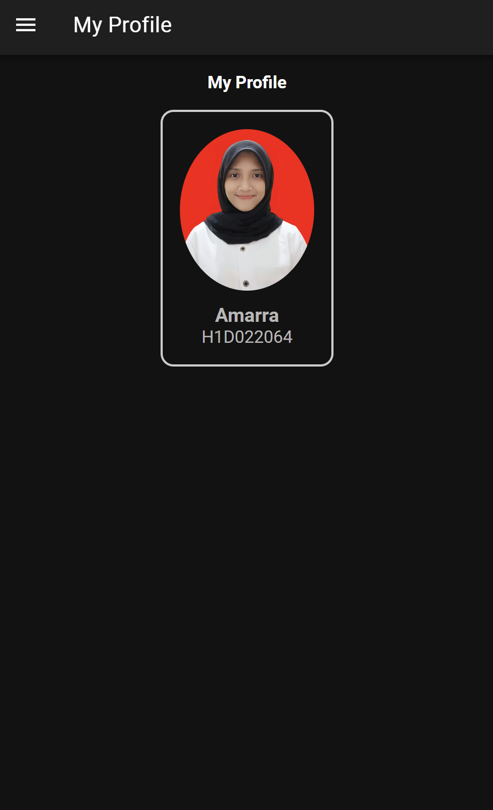

- Variabel folder di TypeScript diikat ke elemen HTML <ion-title>{{ folder }}</ion-title> dan <strong class="capitalize">{{ folder }}</strong>, yang berarti setiap perubahan nilai folder di TypeScript akan secara otomatis memperbarui tampilan di halaman.
- photoUrl juga diambil dari TypeScript dan digunakan dalam elemen , sehingga foto profil dapat ditampilkan sesuai dengan nilai yang ditentukan.
- Dengan menggunakan ActivatedRoute, halaman dapat menampilkan konten yang relevan berdasarkan parameter yang diterima di URL, membuat aplikasi lebih dinamis dan responsif terhadap navigasi pengguna.
